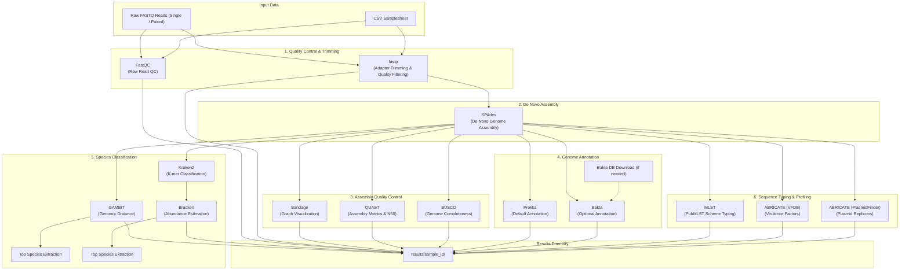

# BactogenMiner

[](https://www.nextflow.io/)
[](https://www.nextflow.io/)
[](https://www.docker.com/)
[](https://docs.conda.io/)

**BactogenMiner** is a scalable, reproducible Nextflow (DSL2) workflow designed for end-to-end bacterial whole-genome sequencing (WGS) data analysis. It automates quality control, read trimming, *de novo* assembly, assembly evaluation, genome annotation, taxonomic identification, sequence typing, and screening for virulence factors and plasmid replicons.

---

## Table of Contents

- [Overview & Key Features](#overview--key-features)
- [Pipeline Architecture](#pipeline-architecture)
- [Workflow Steps](#workflow-steps)
- [Prerequisites & Dependencies](#prerequisites--dependencies)
- [Reference Databases](#reference-databases)
- [Installation](#installation)
- [Usage](#usage)
  - [1. Single-sample Mode](#1-single-sample-mode)
  - [2. Multi-sample Mode (Samplesheet)](#2-multi-sample-mode-samplesheet)
  - [3. Execution Profiles](#3-execution-profiles)
- [Parameters Reference](#parameters-reference)
  - [Input / Output](#input--output)
  - [Taxonomic Classification](#taxonomic-classification)
  - [Genome Annotation](#genome-annotation)
  - [Assembly, QC & Typing](#assembly-qc--typing)
  - [Compute Resources](#compute-resources)
- [Output Directory Structure](#output-directory-structure)
- [Tools and Citations](#tools-and-citations)
- [Author and Contact](#author-and-contact)

---

## Overview & Key Features

- **Automated QC & Preprocessing**: Performs FastQC quality checks and fastp adapter trimming/filtering on paired-end or single-end Illumina reads.
- **Robust *De Novo* Assembly**: Employs SPAdes for contig/scaffold reconstruction and assembly graph generation.
- **Multifaceted Assembly QC**:
  - Contig continuity and N50 statistics using **QUAST**.
  - Assembly graph visual exploration using **Bandage**.
  - Core conserved gene completeness benchmarking using **BUSCO** (`bacteria_odb12` lineage).
- **Flexible Genome Annotation**:
  - Rapid, standard bacterial annotation via **Prokka** (default).
  - High-precision annotation via **Bakta** (with automated database download or local database support).
- **Dual Taxonomic Classification Support**:
  - Ultra-fast genomic distance-based classification via **GAMBIT** with automated top-species resolution.
  - K-mer based metagenomic classification with **Kraken2** and abundance re-estimation with **Bracken**.
- **In Silico Sequence Typing**: Multi-Locus Sequence Typing (**MLST**) against PubMLST typing schemes with automatic schema detection.
- **Virulence & Plasmid Screening**: Screen assemblies for virulence factors (**VFDB**) and plasmid replicons (**PlasmidFinder**) via **ABRICATE**.
- **Reproducible Execution**: Built-in containerized profiles (**Docker** via BioContainers) and environment recipes (**Conda**).

---

## Pipeline Architecture



---

## Workflow Steps

1. **Read QC and Trimming**:
   - **FastQC**: Evaluates raw sequence quality, per-base quality scores, GC content, and duplication levels.
   - **fastp**: Performs automated adapter detection, quality trimming, poly-G tail clipping, and front/tail trimming.
2. **De Novo Assembly**:
   - **SPAdes**: Assembles high-quality trimmed reads into scaffolds (`<sample>.fasta`) and assembly graphs (`<sample>.fastg`).
3. **Assembly Quality Control**:
   - **Bandage**: Renders visual images of the assembly graph topology.
   - **QUAST**: Calculates contig lengths, N50, L50, GC content, and comprehensive HTML summary reports.
   - **BUSCO**: Assesses genome completeness based on universal bacterial single-copy orthologs (`bacteria_odb12`).
4. **Genome Annotation**:
   - **Prokka** *(Default)*: Rapidly annotates CDS, tRNA, rRNA, and signal peptides, outputting GFF3, GenBank, and FASTA files.
   - **Bakta** *(Optional)*: Comprehensive bacterial genome annotation utilizing updated databases. Can automatically fetch databases using `BAKTA_BD`.
5. **Taxonomic Classification**:
   - **GAMBIT** *(Default)*: Rapid identification via genomic signatures against curated reference databases.
   - **Kraken2** & **Bracken** *(Optional)*: Exact k-mer matching and Bayesian abundance estimation at custom taxonomic ranks.
6. **Typing & Plasmid/Virulence Profiling**:
   - **MLST**: Scans contigs against PubMLST databases for sequence type (ST) and allele profile determination.
   - **ABRICATE**: Mass screening of contigs for:
     - **VFDB**: Bacterial virulence factors.
     - **PlasmidFinder**: Plasmid replicon typing and identification.

---

## Prerequisites & Dependencies

- **Nextflow** (>= 22.10.0)
- **Container Engine or Package Manager**:
  - **Docker** (recommended for seamless reproducibility)
  - **Conda / Mamba** (using environment definitions in `envs/`)

Hardware requirements depend on the size and number of genomes analyzed. By default, processes use available CPUs and up to 28 GB RAM (configurable via parameters).

---

## Reference Databases

Ensure required databases are accessible before running species classification or advanced annotation:

| Tool | Purpose | Source / Download Link |
|---|---|---|
| **GAMBIT** | Genomic distance classification | [GAMBIT Databases](https://gambit-genomics.readthedocs.io/en/latest/databases.html) |
| **Kraken2 / Bracken** | K-mer classification & abundance | [Ben Langmead AWS Indexes](https://benlangmead.github.io/aws-indexes/k2) |
| **Bakta DB** *(Optional)* | Full or light annotation database | Automatically downloaded if `--use_bakta` or via [Bakta Documentation](https://github.com/oschwengers/bakta#database) |
| **BUSCO Lineage** | Gene completeness benchmarking | Auto-downloaded during run (`bacteria_odb12`) |
| **VFDB / PlasmidFinder** | Virulence and plasmid typing | Bundled within ABRicate |

---

## Installation

Clone the repository:

```bash
git clone https://github.com/MOISECHRIST/bacteria_typing-phylogeny.git
cd bacteria_typing-phylogeny
```

Ensure Nextflow is installed and functioning:

```bash
nextflow -version
```

---

## Usage

### 1. Single-sample Mode

To analyze a single sample with paired-end reads:

```bash
nextflow run main.nf \
  -profile docker \
  --reads "data/sample01_{1,2}.fastq.gz" \
  --sample_name "sample01" \
  --use_gambit \
  --gambit_db "/path/to/gambit/db" \
  --outdir "results"
```

For single-end data:

```bash
nextflow run main.nf \
  -profile conda \
  --reads "data/sample01.fastq.gz" \
  --sample_name "sample01" \
  --gambit_db "/path/to/gambit/db" \
  --outdir "results"
```

---

### 2. Multi-sample Mode (Samplesheet)

To process a batch of samples in parallel, provide a CSV samplesheet formatted as follows:

```csv
sample_id,fastq_1,fastq_2
ERR4422341,test/data/ERR4422341_1.fastq.gz,test/data/ERR4422341_2.fastq.gz
ERR4422727,test/data/ERR4422727_1.fastq.gz,test/data/ERR4422727_2.fastq.gz
```

Run the pipeline:

```bash
nextflow run main.nf \
  -profile docker \
  --samplesheet_csv "samplesheet.csv" \
  --gambit_db "/path/to/gambit/db" \
  --outdir "results"
```

---

### 3. Execution Profiles

Pre-configured profiles in `nextflow.config` can be combined using comma-separated arguments:

- `docker`: Executes all processes inside official BioContainers.
- `conda`: Automatically configures environments from YAML specifications in `envs/`.
- `test`: Executes pipeline with bundled test data (`test/data/sample_sheet.csv`).
- `using_gambit`: Activates GAMBIT-based taxonomy with bundled test database.
- `using_kraken2`: Activates Kraken2 + Bracken taxonomy with bundled test database.

#### Example Commands

Run test dataset with Docker and GAMBIT:
```bash
nextflow run main.nf -profile test,docker,using_gambit
```

Run test dataset with Conda and Kraken2:
```bash
nextflow run main.nf -profile test,conda,using_kraken2
```

Run with Bakta annotation enabled instead of Prokka:
```bash
nextflow run main.nf \
  -profile docker \
  --samplesheet_csv "samplesheet.csv" \
  --gambit_db "/path/to/gambit/db" \
  --use_bakta \
  --bakta_db_type "light" \
  --outdir "results"
```

---

## Parameters Reference

### Input / Output

| Parameter | Type | Default | Description |
|---|---|---|---|
| `--reads` | String | `null` | File path pattern for single or paired-end FASTQ reads (e.g. `"data/*_{1,2}.fastq.gz"`) |
| `--samplesheet_csv` | String | `null` | Path to CSV samplesheet with header `sample_id,fastq_1,fastq_2` |
| `--sample_name` | String | `'sample01'` | Identifier used when running in single-sample mode with `--reads` |
| `--outdir` | String | `'results'` | Output directory where final results will be organized |

### Taxonomic Classification

| Parameter | Type | Default | Description |
|---|---|---|---|
| `--use_gambit` | Boolean | `true` | Enable GAMBIT species identification |
| `--gambit_db` | String | `null` | Directory path to GAMBIT reference database |
| `--use_kraken2` | Boolean | `false` | Enable Kraken2 taxonomic classification and Bracken re-estimation |
| `--kraken_db` | String | `null` | Path to Kraken2 reference database directory |
| `--bracken_class_level` | String | `'S'` | Taxonomic rank for Bracken abundance estimation (`D`, `P`, `C`, `O`, `F`, `G`, `S`) |
| `--kraken_read_len` | String | `'100'` | Read length parameter for Bracken estimation |
| `--bracken_threshold` | String | `'0'` | Minimum read threshold required prior to abundance re-estimation |

### Genome Annotation

| Parameter | Type | Default | Description |
|---|---|---|---|
| `--use_bakta` | Boolean | `false` | Enable Bakta annotation (defaults to Prokka if `false`) |
| `--bakta_db` | String | `null` | Path to existing Bakta database directory |
| `--bakta_db_type` | String | `'full'` | Database type to auto-download if `--bakta_db` is omitted (`'light'` or `'full'`) |

### Assembly, QC & Typing

| Parameter | Type | Default | Description |
|---|---|---|---|
| `--busco_lineage` | String | `'bacteria_odb12'` | BUSCO lineage dataset for genome completeness assessment |
| `--mlst_scheme` | String | `null` | Specific MLST scheme (e.g. `ecoli`, `saureus`). Automatically inferred if omitted |

### Compute Resources

| Parameter | Type | Default | Description |
|---|---|---|---|
| `--max_cpus` | Integer | System cores - 2 | Maximum CPUs allocated to high-resource processes |
| `--max_mem` | String | `'28.GB'` | Maximum memory allocated to high-resource processes |

---

## Output Directory Structure

Pipeline results are organized hierarchically by sample identifier:

```text
results/
├── <sample_id>/
│   ├── fastqc/
│   │   ├── <sample_id>_fastqc.html             # Raw read FastQC report
│   │   └── <sample_id>_fastqc.zip              # FastQC data metrics archive
│   ├── fastp/
│   │   ├── <sample_id>_trimmed_R1.fastq.gz     # Filtered & trimmed forward reads
│   │   ├── <sample_id>_trimmed_R2.fastq.gz     # Filtered & trimmed reverse reads
│   │   ├── <sample_id>_report.fastp.html       # fastp visual HTML summary
│   │   └── <sample_id>_report.fastp.json       # fastp machine-readable stats
│   ├── spades/
│   │   ├── <sample_id>.fasta                   # Assembled genome scaffolds
│   │   └── <sample_id>.fastg                   # Assembly graph file
│   ├── assembly_QC/
│   │   ├── <sample_id>_Bandage_Img.jpg         # Visual rendering of assembly graph
│   │   ├── quast/                              # QUAST contig metrics and HTML reports
│   │   └── Busco/                              # BUSCO completeness summaries (JSON/TXT)
│   ├── Annotation/
│   │   ├── Prokka/                             # Prokka annotation files (.gff, .gbk, .faa, .fna)
│   │   └── Bakta/                              # Bakta annotation outputs (if --use_bakta)
│   ├── Gambit/
│   │   └── <sample_id>_gambit_report.csv       # GAMBIT taxonomic predictions
│   ├── kraken2_Bracken/
│   │   ├── <sample_id>_kraken2_report.txt      # Kraken2 hierarchical classification report
│   │   ├── <sample_id>_kraken2_output.txt      # Per-contig classification output
│   │   ├── <sample_id>_bracken_report.txt      # Bracken adjusted abundance report
│   │   └── <sample_id>_bracken_output.txt      # Bracken abundance estimation table
│   ├── mlst/
│   │   └── <sample_id>_mlst_report.csv         # PubMLST sequence typing and allele profiles
│   └── Abricate/
│       ├── <sample_id>_vfdb_report.txt         # Virulence factor screening results
│       └── <sample_id>_plasmidfinder_report.txt# Plasmid replicon typing results
└── Bakta_DB/                                   # Downloaded Bakta database (if generated)
```

---

## Tools and Citations

If you use BactogenMiner in your research, please cite the tools utilized:

- **Nextflow**: Di Tommaso, P., et al. (2017). Nextflow enables reproducible computational workflows. *Nature Biotechnology*, 35(4), 316–319.
- **FastQC**: Andrews, S. (2010). FastQC: a quality control tool for high throughput sequence data.
- **fastp**: Chen, S., et al. (2018). fastp: an ultra-fast all-in-one FASTQ preprocessor. *Bioinformatics*, 34(17), i884–i890.
- **SPAdes**: Prjibelski, A., et al. (2020). Using SPAdes de novo assembler. *Current Protocols in Bioinformatics*, 70(1), e102.
- **Bandage**: Wick, R. R., et al. (2015). Bandage: interactive visualization of de novo genome assemblies. *Bioinformatics*, 31(20), 3350–3352.
- **QUAST**: Gurevich, A., et al. (2013). QUAST: quality assessment tool for genome assemblies. *Bioinformatics*, 29(8), 1072–1075.
- **BUSCO**: Manni, M., et al. (2021). BUSCO: Assessing genomic data quality and completeness. *Current Protocols in Bioinformatics*, 71(1), e104.
- **Prokka**: Seemann, T. (2014). Prokka: rapid prokaryotic genome annotation. *Bioinformatics*, 30(14), 2068–2069.
- **Bakta**: Schwengers, O., et al. (2021). Bakta: rapid and standardized annotation of bacterial genomes via alignment-free sequence identification. *Microbial Genomics*, 7(11), 000685.
- **GAMBIT**: Lumpe, J., et al. (2023). GAMBIT: rapid and accurate bacterial identification from whole-genome sequencing data. *GigaScience*, 12, giad034.
- **Kraken2**: Wood, D. E., et al. (2019). Improved metagenomic analysis with Kraken 2. *Genome Biology*, 20(1), 257.
- **Bracken**: Lu, J., et al. (2017). Bracken: estimating species abundance in metagenomics data. *PeerJ Computer Science*, 3, e104.
- **MLST**: Seemann, T. `mlst` (GitHub repository: [https://github.com/tseemann/mlst](https://github.com/tseemann/mlst)).
- **ABRICATE**: Seemann, T. `abricate` (GitHub repository: [https://github.com/tseemann/abricate](https://github.com/tseemann/abricate)).

---

## Author and Contact

- **MEKA Moise**
- Email: `moise.meka@students.unibe.ch`
- MSc Bioinformatics and Computational Biology, University of Bern